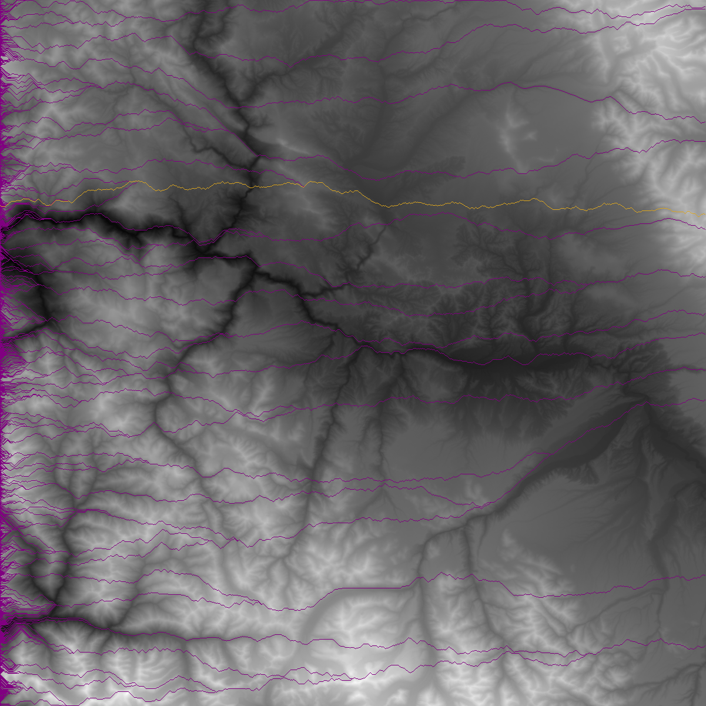

# Pathfinder

## Description

Using object-oriented programming and testing, build a program to read elevation data, draw an elevation map as a `.png` file, and chart the best path across the map.

## Deliverables

- A Git repo containing:
  - A Python file called `pathfinder.py` that when run, creates a file called `map.png`.
  - One or more test files to test your program
  - A `Pipfile` with your dependencies listed in it

## Maps Created:




## Instructions

Read [the Mountain Paths PDF](MountainPaths.pdf) to get started.

Read the data from `elevation_small.txt` into an appropriate data structure to get the elevation data. This file is made up of multiple lines. Each line has a list of numbers representing elevation in meters. The elevation is the maximum elevation for a 90m x 90m square.

The numbers in this file are lined up like x-y coordinates. If the file contains the following:

```
150 175 150 200
170 191 190 182
179 191 180 182
193 195 190 192
```

Then the elevation at the top left corner (x: 0, y: 0) is 150 and the elevation at the bottom right (x: 3, y: 3) is 192. The elevation at x: 1, y: 2 is 191.

Using the [Pillow library](https://pillow.readthedocs.io/en/3.0.x/index.html), create an elevation map from the data. Higher elevations should be brighter; lower elevations darker. Read [the chapter on manipulating images from _Automate the Boring Stuff with Python_](https://automatetheboringstuff.com/chapter17/) to learn how to use Pillow. Once you have that working, add the ability to start from the left edge of the map on any row (y-position) and calculate and draw a path across the map, using the greedy algorithm described in the Mountain Paths PDF. 

## Advanced Mode

Starting from each location on the left-hand side of the map, plot an optimal path across the map. Calculate the total elevation change over that path. (Both moving up and down count toward the total change.) Pick the path with the least change and highlight it, drawing all paths. Your map should look something like this:

If you get that done, then read [the `argparse` module tutorial](https://docs.python.org/3.7/howto/argparse.html). Implement a command-line interface for your program, allowing the user to give the name of the elevation file on the command line. You can add more options, such as the color to use for the optimal path and other paths.

## Credit

Adapted from [Nifty Assignments -- Mountain Paths](http://nifty.stanford.edu/2016/franke-mountain-paths/).
